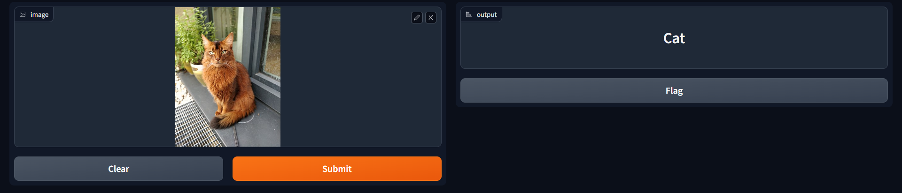
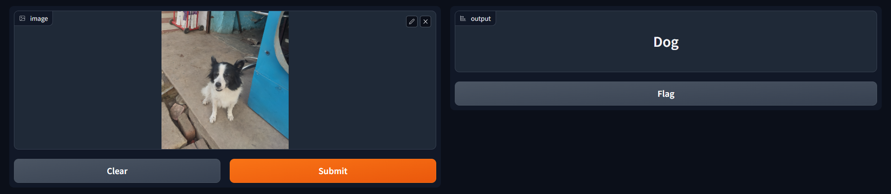

# Image Classifier: Cat vs. Dog

An Image Classifier that predicts whether an input image contains a cat or a dog. This repository provides multiple approaches to the project, including a Jupyter Notebook approach, a modular approach, and a standalone local deployment method.

## Overview

This project aims to build a machine learning model that can accurately classify images of cats and dogs. We've implemented the classifier using different methods to provide a comprehensive understanding of the project.

### Notebook Approach

The [`notebook`](notebook) directory contains a Jupyter Notebook (`ModelCreation.ipynb`) that walks through the complete process of building, training, and evaluating the image classifier model. This approach is great for learning and experimenting with the code in an interactive environment.

### Modular Approach

The [`src`](src) directory contains a modular approach to the project. We've broken down the project into different components for better organization and scalability. Key components include:

- `data_ingestion_transformation.py`: Handles data ingestion, transformation, and splitting into train, test, and validation sets.
- `model_trainer.py`: Defines the ModelTrainer class responsible for training the classifier model.


### Standalone Local Deployment

For a standalone local deployment, you can run the Gradio interface to predict whether an image contains a cat or a dog. Follow these steps:
- `deployment.py`: Sets up a Gradio interface for interactive predictions using the trained model.
1. Install the required dependencies:
   ```sh
   pip install -r requirements.txt
   python src\components\deployment.py

2. Result of model with gradio:





### Usage
Notebook: Follow the step-by-step instructions in the notebook directory to learn how to build and train the classifier.
Modular: Utilize the modular components in the src directory to customize and enhance the project.
Standalone Local Deployment: Use the Gradio interface to predict whether an image contains a cat or a dog by following the deployment instructions.